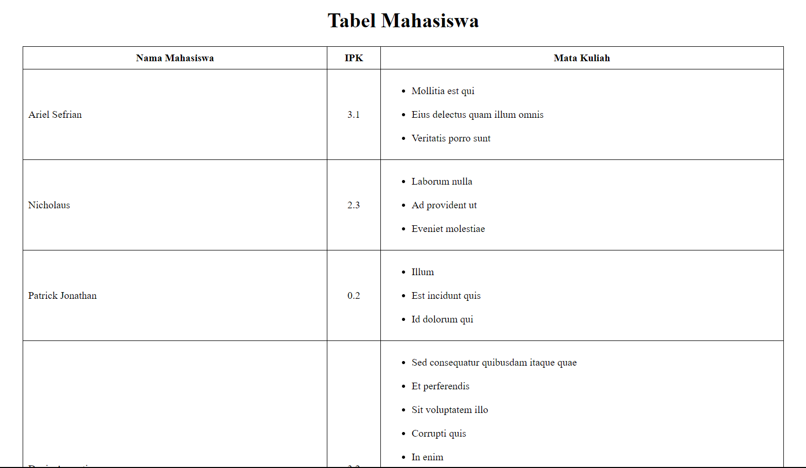
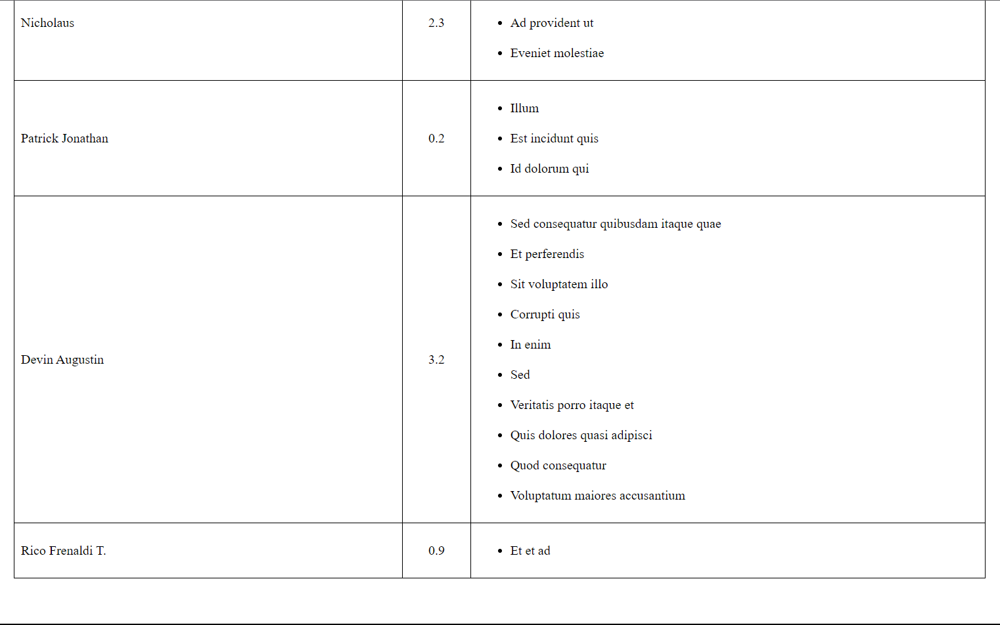

# Simple Table Get from Database

Repository ini berisi tentang sebuah tabel simpel yang menunjukkan nama mahasiswa beserta ipk dan mata kuliah yang diikutinya.

### One to One Relationship
Setiap mahasiswa (student) memiliki 1 nilai IPK dalam bentuk float atau double

### One to Many Relationship
Setiap mahasiswa (student) dapat memiliki banyak mata kuliah yang diikuti

#### Keterangan:
<ul>
<li>Nama digenerate secara manual pada DatabaseSeeder.</li>
<li>IPK setiap mahasiswa digenerate secara random, tetapi student_id foreign key-nya itu diurutkan dari 1 sampai 5.</li>
<li>Nama Mata Kuliah digenerate secara random dengan menggunakan factory() dan dengan nama dummy.</li>
</ul>
